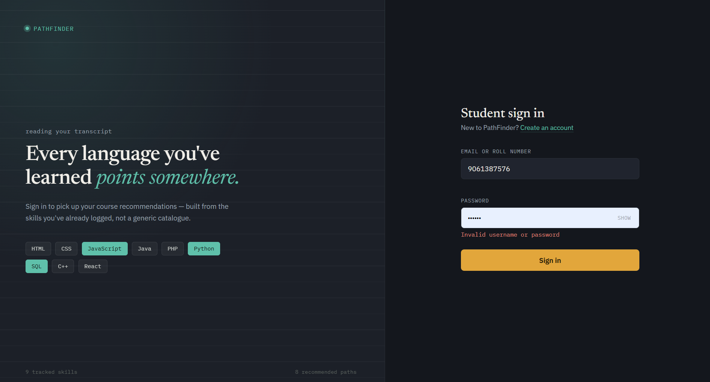
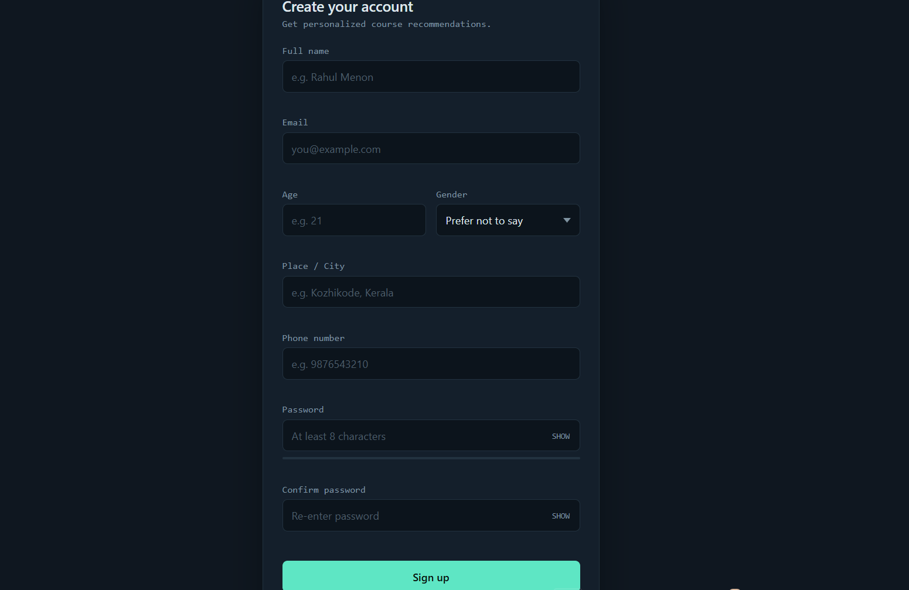
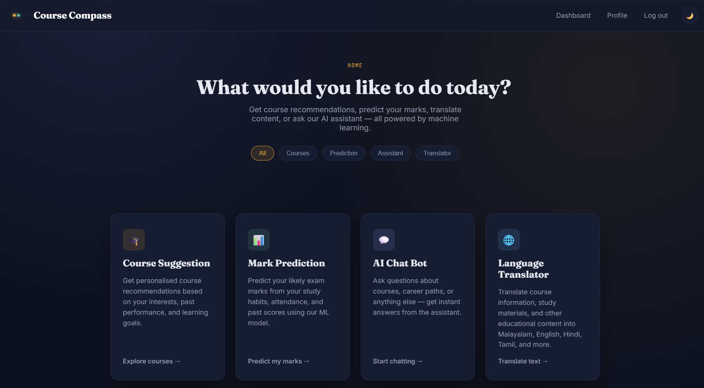
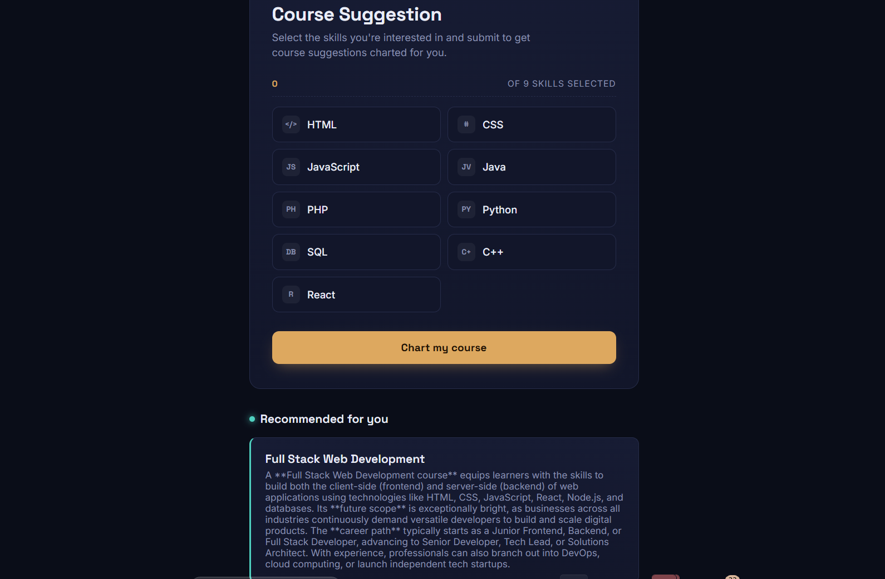
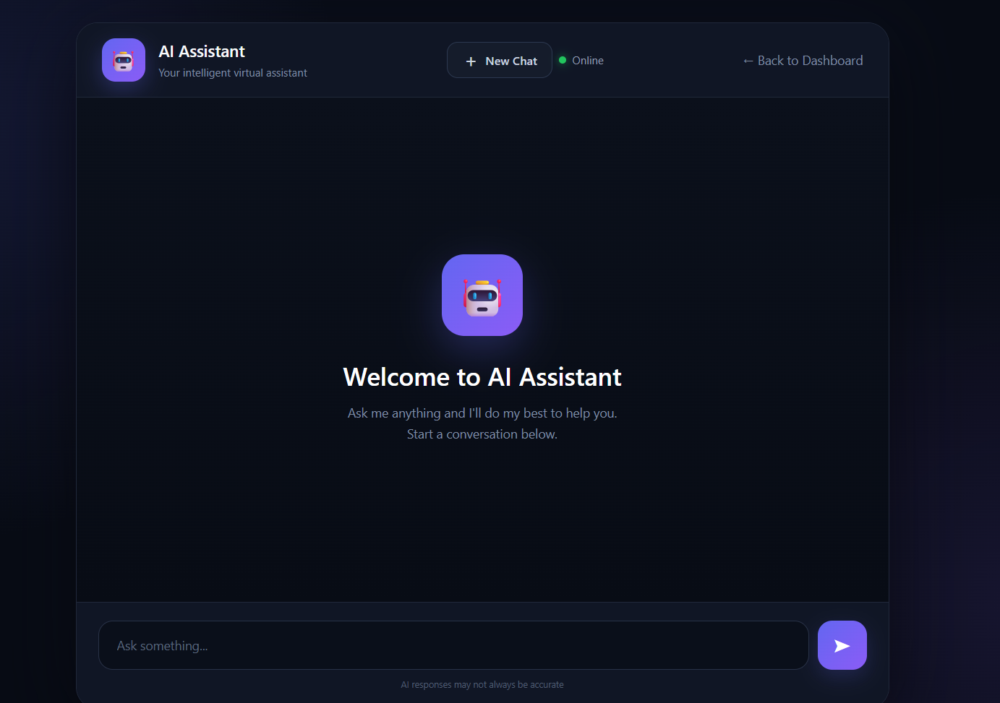
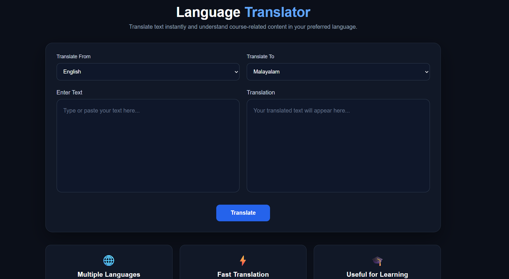
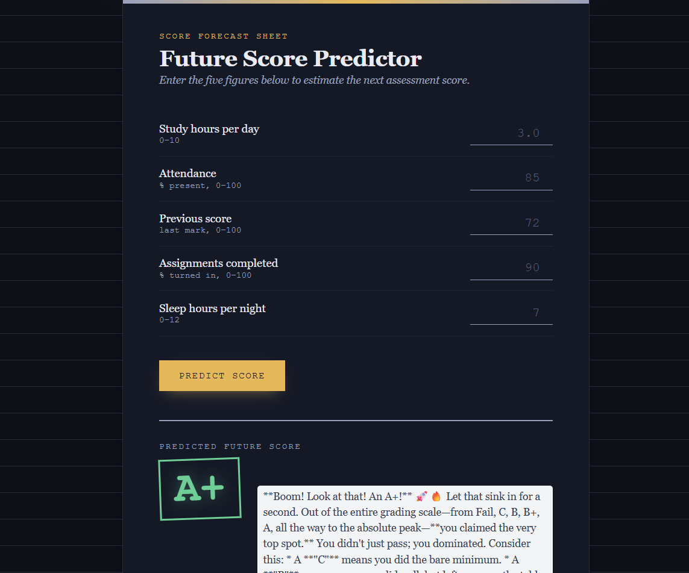

# Course Compass

**Course Compass** is a Django-based student learning assistant that combines course recommendations, academic score prediction, an AI assistant, and language translation in one web application.

## ✨ Features

### 🔐 Student Authentication
- Student sign-up and sign-in
- Full name, email, age, gender, city, phone number and password
- Login validation

### 🏠 Student Dashboard
The dashboard provides access to:
- Course Suggestion
- Mark Prediction
- AI Chat Bot
- Language Translator
- Profile and logout

### 🎓 Course Suggestion
Students select skills they are interested in, including:
- HTML
- CSS
- JavaScript
- Java
- PHP
- Python
- SQL
- C++
- React

The system generates personalized course recommendations based on the selected skills.

### 📊 Mark Prediction
Students provide:
- Study hours per day
- Attendance
- Previous score
- Assignments completed
- Sleep hours per night

The system predicts a future score/grade using the project's machine-learning functionality.

### 🤖 AI Assistant
A conversational assistant for questions about:
- Courses
- Career paths
- Learning
- Educational topics

### 🌐 Language Translator
Users can:
- Select a source language
- Select a target language
- Enter text
- Generate a translated result

This is useful for translating course and study content into a preferred language.

## 🖥️ Screenshots

### Student Login


### Student Registration


### Dashboard


### Course Suggestion


### AI Assistant


### Language Translator


### Future Score Predictor


## 🛠️ Technology

- Python
- Django
- HTML
- CSS
- JavaScript
- Machine Learning
- AI integration
- Translation functionality

> The exact ML models, datasets, and external services depend on the implementation in the project source code.

## 📁 Project Structure

```text
CoursePrediction/
│
├── manage.py
├── myapp/
│   ├── migrations/
│   ├── templates/
│   ├── models.py
│   ├── views.py
│   ├── urls.py
│   └── ...
│
├── CoursePrediction/
│   ├── settings.py
│   ├── urls.py
│   ├── asgi.py
│   └── wsgi.py
│
├── Screenshots/
├── requirements.txt
├── .gitignore
└── README.md
```

## ⚙️ Installation

### 1. Clone the repository

```bash
git clone <your-repository-url>
cd <project-folder>
```

### 2. Create a virtual environment

```bash
python -m venv venv
```

On Windows:

```bash
venv\Scripts\activate
```

### 3. Install dependencies

```bash
pip install -r requirements.txt
```

### 4. Apply migrations

```bash
python manage.py makemigrations
python manage.py migrate
```

### 5. Run the development server

```bash
python manage.py runserver
```

Then open:

```text
http://127.0.0.1:8000/
```

## 🔒 Environment Variables

If the project uses API keys or other secrets, keep them in a local `.env` file.

Example:

```env
API_KEY=your_api_key_here
```

Add `.env` to `.gitignore`:

```gitignore
.env
```

**Never commit real API keys, passwords, or other secrets to GitHub.**

## 🎯 Project Purpose

Course Compass brings several student-focused tools together in one platform.

The application helps students:

1. Discover suitable courses.
2. Explore learning paths based on their interests.
3. Estimate future academic performance.
4. Ask questions through an AI assistant.
5. Translate educational content.

## 🚀 Future Improvements

- Resume/file upload for personalized recommendations
- Voice input for the AI Assistant
- More course categories
- Improved recommendation models
- Detailed prediction reports
- Student progress tracking
- Personalized learning plans
- Additional language support
- Production deployment and improved security

## 👨‍💻 Author

**Rahul T P**  
Python Full Stack Developer

---

⭐ If you find this project useful, consider giving the repository a star.
